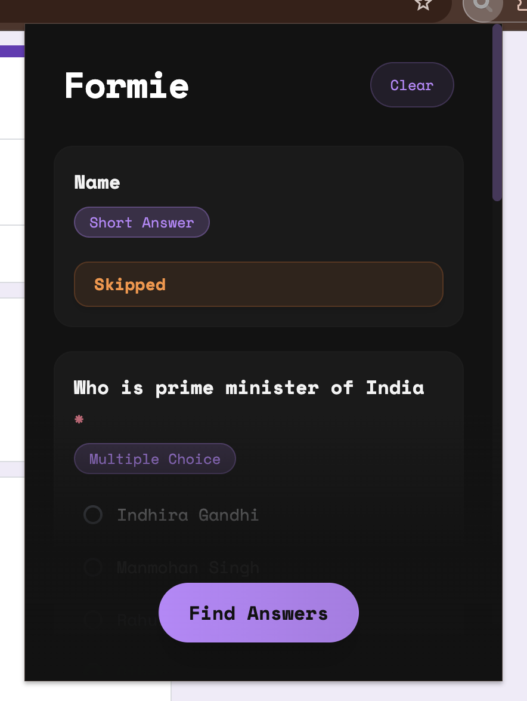
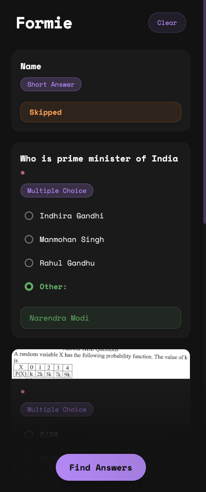

# Formie

Formie is an AI powered browser extension to automatically ~fill out forms for you~ generate answers for the form.
It can handle surveys, applications, or any other type of form on Google Forms. Formie can analyze the questions and provide intelligent answers to save you time.

## TODO

- [x] **Analyzes form questions** - Formie extracts and reads through all the questions on a form
- [x] **Generate answers** - Using Gemini, it creates appropriate responses based on the question type and context
- [x] **Sidebar integration** - Allows to open the extension in sidebar to fill the form with ease
- [x] **Fill the form automatically** - Formie can fill the entire form with answers
- [ ] **Personal Information** - Formie understands you with your personal information to fill such personal questions
- [ ] **Prompt Injection** - Give user control over the answers with prompt injection
- [ ] **Custom API key** - Formie can use the custom api key from users instead
- [ ] **Model Selection** - Allows users to opt in to Gemini, ChatGPT or Claude as their wish.

## Supported Platforms

- [x] Google Forms (`forms.google.com`)
- [x] Google Docs Forms (`docs.google.com/forms`)
- [ ] Microsoft Forms (`forms.office.com`)
- [ ] Microsoft 365 Forms (`forms.microsoft.com`)

## Screenshots

| Extension                                | Sidebar                                  |
| ---------------------------------------- | ---------------------------------------- |
|  |  |

## Installation

### For Development

1. **Clone this repository**

   ```bash
   git clone https://github.com/rahuletto/formie
   cd Formie
   ```

2. **Install dependencies**

   ```bash
   bun install
   ```

3. **Build the extension**

   ```bash
   bun run build
   ```

4. **Load in your browser**
   - Open Chrome/Edge and go to `chrome://extensions/`
   - Enable "Developer mode"
   - Click "Load unpacked" and select the `build` folder

> [!IMPORTANT]
> The extension will **not** be available on the Chrome Web Store or Edge Add-ons store as this can violate their T&C.

## Privacy & Security

- Formie only works on form pages you explicitly visit
- No personal data is stored permanently
- All AI processing is done by Google and subjected to their [Privacy](https://support.google.com/gemini/answer/13594961?hl=en#privacy_notice)
- The extension only has access to form pages, not your entire browsing

## Support

Having issues or questions? Feel free to open an issue on GitHub or reach out on any platform.

## License

This extension uses MIT License
